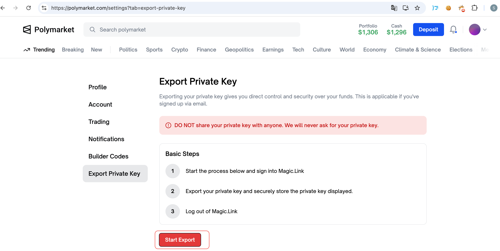
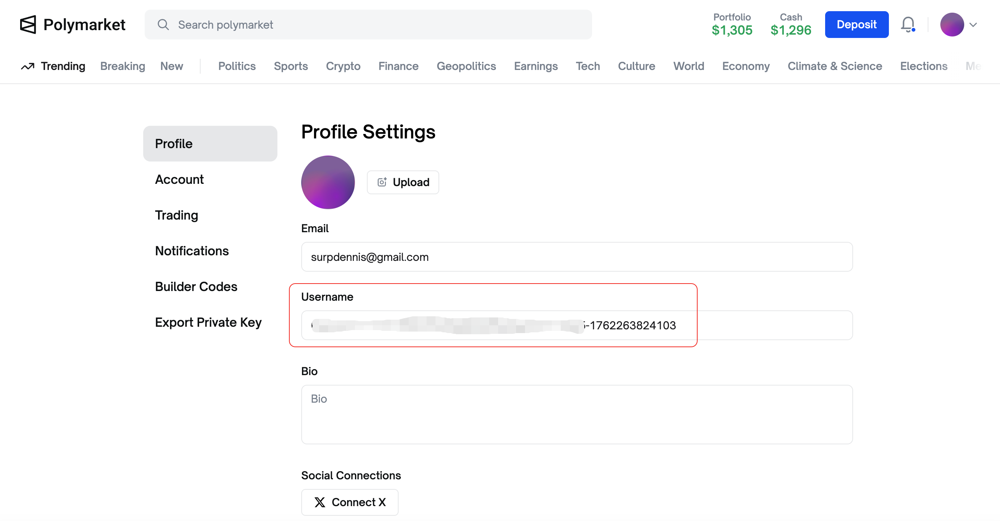
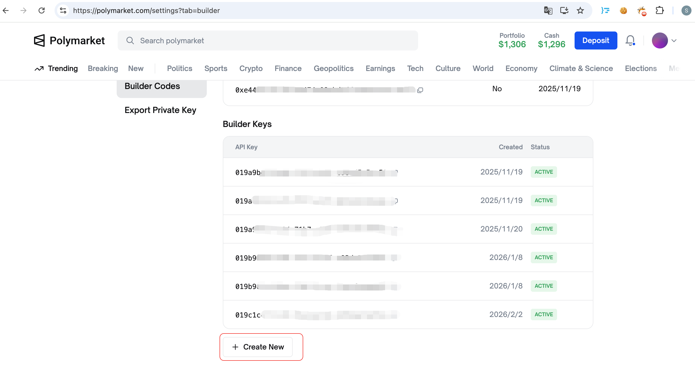

# PRIVATE_KEY
进入https://polymarket.com/settings?tab=export-private-key，点击Start Export，获取Private Key

# FUNDER地址
进入https://polymarket.com/settings, 选择username中"-"符号之前的内容

# API_KEY、API_SECRET、API_PASSPHRASE
进入https://polymarket.com/settings?tab=builder，点击Create New后，保存生成的API_KEY、API_SECRET、API_PASSPHRASE

